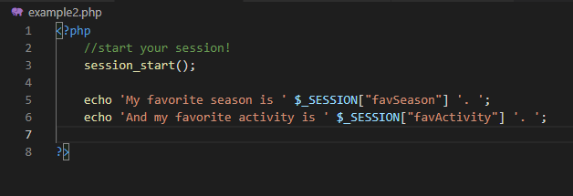
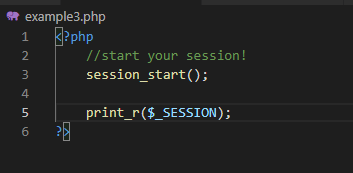
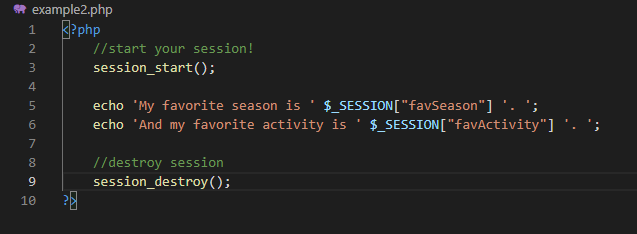
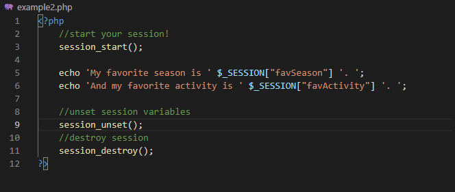

# PHP Sessions Tutorial
Learning PHP can be a daunting task, and fundamental to that is understanding how PHP sessions work, and how to set them up. 

So what exactly is a PHP session? PHP sessions have to do with memory storage. I like to think of PHP sessions as my test study sessions. When I am studying for a test, I sit down, open my textbook and begin to memorize any bit of information I might find useful. Then after I've taken my test and turned it in, I almost immediately forget all those specific facts that I memorized in order to pass the test. PHP sessions work similar to this. I would define a PHP session as browser-term memory. At the beginning of a web page, a PHP session is opened and it stores very specific information. It keeps this information in an array, and accesses it when it needs to. Then, when the browser is closed and the information isn't needed anymore, the information is forgotten! The PHP session memory only lasts as long as the browser!

In more technical terms, every time a computer connects to the internet it is connected to a server. The browser open on the computer sends information requests to the server, and the server responds with the information. **Stateless** communication is the basic communication between the browser and the server. The browser sends a request, the server responds, without caring about the specifics of who the computer is. With a PHP session, a browser sends a request to the server, and the server responds with the requested information, and a **session ID** which is a unique identifier. In every single communication that follows, the session ID is passed along with the information. This is how the server knows it is coming from the same browser. Other information is stored on the server and can be accessed by the browser because it has that session ID that it passes back and forth. If you're having trouble understanding why we use PHP sessions and how they work, here is a great [video explanation](https://www.linkedin.com/learning/php-managing-persistent-sessions/how-php-sessions-work)!

# Opening a PHP Session
Let's create two `.php` files and call them `example.php` and `example2.php`. In order to begin storing session variables in these files, you must start the session. This can be achieved through a simple start function! We'll put it at the beginning of our `example.php` page.

Make sure that you have your `<?php` tag to start and your `?>` tag to end. That's how your computer knows you're writing in PHP.

The `session_start()` function first looks for a previous session ID. If it finds one, it will set up the session variables, if it doesn't, it will start a new session. The `session_start()` function must also be the very first thing in your code, before any HTML tags, otherwise the session won't begin correctly.

This `session_start()` function will also need to be at the beginning of every page of the website that needs access to the session variables, which we will set up in just a minute!

If your `example2.php` page needs access to the session variables, you would set it up the same way:

Okay, now that our session has begun, we can set session variables!

# Setting Your Session Variables
In PHP, a `$` indicates a variable, and with session variables it is also used, but you must be a bit more specific. Session variables are declared in this way:

`$_SESSION["yourVariable"] = "value";`

We'll call the part `$_SESSION["yourVariable"]` the key of your variable, while `"value"` is the value you set your variable to.

You can set your session variables right in those first PHP tags if you like!

In the code above we set two session variables. Since these are session variables they will always have the same values as long as the session is open, even if we reference them in another page of the website!

# Accessing Session Variables

Let's test that by referencing those session variables in our `example2.php` file. We'll print those out using `echo`.

Now hang on! Those variables haven't even been declared before in `example2.php`! How is it that they can be used like that?

Good question! They are session variables, so they exist with the session. Since the session was opened in `example.php` and the variables were declared there, the variables exist in the session (remember the browser-term memory). A session was opened at the beginning of `example2.php` and the `session_start()` function looked back to see if a session already exists. Since it does, those session variables are now available to be used! So `example2.php` in a sense recreates and continues using the session that was created in `example.php`. Because of that, there is no need to recreate those session variables!

So how are these variables actually stored? I said at the beginning that we would call the `$_SESSION["yourVariable"]` chunk our key and the `"value"` chunk our value. Session variables are stored in the session array: `$_SESSION[]`. The name `"yourVariable"` is the key, or address of the value (hint: `"value"`) that we are looking for.

When we declared `$_SESSION["favSeason"] = "summer"` in our `example.php` we created a key `"favSeason"` and set the value associated to it to `"summer"`. Then we did the same thing for `$_SESSION["favActivity"] = "swimming"`. This array lasts as long as the session lasts, and can be used on any page within our site as long as the browser is open.

Our `example2.php` can access that array because `session_start()` is a really smart function, and when it looked back to see if a session already existed, it saw that the session started in `example.php` was stil open. Then it jumped right into that session and grabbed that array. This is why it is so important to use `session_start()` at the beginning of every `.php` page we create as part of our website. If we don't, that `$_SESSION[]` array isn't accessible.

You can also print out the entire session array by using the command `print_r($_SESSION);` like so:

This is a good way to debug your code and make sure that your session array contains what you want it to contain!

# Ending Your Session
Because your session only lasts as long as the browser is open it will eventually end. But the information stored in the session can stick around for a little longer, and it isn't immediately destroyed upon closing the browser. This is important because if, for example, your website requires a login page with a username and password, you'll need that username and password to be stored in the session array so that you can access all parts of the website. But if you exit out of the browser without removing that important information from the session array, that information could be at risk since it's still lingering there. That's why there are a couple different methods to getting rid of part or all of the session variables.

If you want to individually get rid of specific variables you can use `unset()`. Let's say we want to take our `$_SESSION["favActivity"]` variable out of the array. We would call `unset($_SESSION["favActivity"])`. That gets rid of that key and value and it can no longer be accessed!

However, getting rid of our session variables in that way is not very effective. To clear your session array and unset every variable, you would need to use `session_unset()`. Calling this function applies it to all parts of the `$_SESSION` array and empties it. This is a great option if you only want to clear your array, but it will not destroy the entire session for you.

To destroy the session data the function `session_destroy()` is used. This does exactly what it says: it destroys the data stored in the session completely. The session is ended but if you start up a session again, those variables will still be there! This function destroys the session but does not clear the variables out of the array.

In order to completely clear out information and get a fresh new session, it is necessary to call `session_unset($_SESSION)` and then destroy the session using `session_destroy()`. This is the only way to kill the session all together and keep sensitive data from hanging around in the server after the browser is closed. 

There are some situations in which you would want your session data to be persistent, but that requires additional security measures that we won't cover in this tutorial. 

# Additional Resources

Included below are links to a few tutorials and other resources that I found helpful in understanding PHP sessions and how they work, as well as how to set them up.

[TutorialRepublic on PHP sessions](https://www.tutorialrepublic.com/php-tutorial/php-sessions.php#:~:text=To%20begin%20a%20new%20session,simply%20starts%20a%20new%20session.) : Fantastic additional tutorial to help you understand how to set up PHP sessions.

[w3schools: PHP sessions](https://www.w3schools.com/php/php_sessions.asp) : Information from w3schools on PHP sessions.

[ThoughtCo on PHP](https://www.thoughtco.com/basic-php-sessions-2693797) : More information to help in understanding how PHP sessions work.

[php.net: $_SESSION in depth](https://www.php.net/manual/en/reserved.variables.session.php) : More information about the `$_SESSION` array.

[php.net: `session_unset()` in depth](https://www.php.net/manual/en/function.session-unset.php) : More information about `session_unset()`.

[php.net: `session_destroy()` in depth](https://www.php.net/manual/en/function.session-destroy.php#:~:text=session_destroy()%20destroys%20all%20of,or%20unset%20the%20session%20cookie.&text=Cleanup%20%24_SESSION%20array%20rather,ID%20must%20also%20be%20unset.) : More information about `session_destroy`.